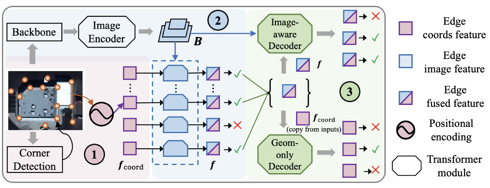


# Reproduction of HEAT: Holistic Edge Attention Transformer for Structured Reconstruction
## Student credentials
This blog post is made by students of the TU Delft as part of the course Deep Learning. The students are:

Jeroen Hofland, 4678141, <j.l.hofland@student.tudelft.nl>

Jochem van Lith, 4917634, <j.a.e.vanlith@student.tudelft.nl>

Joost Jansen, 4807179, [j.j.jansen-2@student.tudelft.nl](mailto:j.j.jansen-1@student.tudelft.nl)

The source code available for this blog post is a slight adaptation of [HEAT](https://github.com/woodfrog/heat).

## Introduction

In recent years, Transformer Neural Networks have shown success in a broad range of computer vision tasks. One of the methods that try to solve a specific problem in the field of structured reconstruction is Holistic Edge Attention Transformer ([HEAT](https://openaccess.thecvf.com/content/CVPR2022/html/Chen_HEAT_Holistic_Edge_Attention_Transformer_for_Structured_Reconstruction_CVPR_2022_paper.html)). The method aims to extract geometric structure from images (eg. floorplans) and does this by constructing a planar graph that represents the underlying geometric structure of the input image. In this blog post, we aim to explain and evaluate HEAT by Chen, Qian, and Furukawa. We will do this by replicating the experiments on two validation sets as mentioned in the paper. By doing so we aim to critically analyze the ability to reproduce the results of the paper and report on the generalizability to new datasets. Additionally, we will use the pre-trained model from their repository and fine-tune it by adding new training data from a data source containing real floorplans without density maps (different type of floorplan data) to further assess the performance of the method and compare it to the results found. 

## HEAT explained
To further illustrate how HEAT works we will shortly describe the four major steps that the method takes. HEAT first identifies corners, or equivalently points where two edges intersect, in a 2D image by using any corner detector. For the best performance a variant of HEAT’s edge detection architecture, which we will talk about in a bit, is used on pixels as corner candidates. Instances of corners used in this blog will be corners of a building or intersections between walls in a floorplan. 

Each pair of corners now becomes an edge candidate and a Transformer node. The coordinates of the endpoints of each edge are initialized as a trigonometric (read: relative) positional encoding [source]. By doing so the model can learn how the edges are positioned in relation to each other and the overall image. Now that we have a set of candidate edges, HEAT fuses image features to each candidate using adaptive deformable attention. This allows the model to focus on the important regions of the image. 


**Figure 1: Pipeline of HEAT architecture**

HEAT also uses an Image-aware or Geometry-only weight-sharing Transformer decoder to learn holistic structural patterns over the graph edge candidates. The Image-aware decoder takes into account both the geometric structure of the edges in the image as well as the image features. The Geometry-only decoder only focuses on the first part of finding geometric structures without the use of image features. For geometric features, one must think of position, angles, and edge length. By using both these encoders HEAT can analyze the influence of the performance of having only geometrical data available. 

During training, HEAT employs a masked learning strategy. This means that part of the input data are hidden or equivalently masked from the model during the training. This forces the model to learn from the visible parts and aims to improve the generalizability over unseen or noisy data. 

## Installation guide
During our installation of HEAT we encountered multiple problems with the relative depencies. This was especially related to MultiScaleDeformableAttention module which has old depencies and only works in specific situations as it is not updated anymore. Eventually we succeeded to install HEAT by the following specific steps. These are illustrated below for local installation. Do note that since we use CUDA it requires an nvidia GPU on your computer. For people that do not have access to this hardware we have created a [Google Colab](https://colab.research.google.com/drive/1wk7vClFb1_PlSdFUpAdTCzwvr0bTpi_s?usp=sharing) with a step-by-step installation guide to run it on the servers of Google. 

**Step 1:** Install NVIDIA CUDA

Download the CUDA installer for your operating system and architecture. The download can be found [at this link](https://developer.nvidia.com/cuda-11-7-0-download-archive?target_os=Windows&target_arch=x86_64). For this reproduction, the Windows operating system was used with a x86\_64 architecture. In the installer choose the “Network” option and follow the instructions to complete the installation. 

**Step 2:** Install Microsoft Visual C++

Head over to the Microsoft Visual Studio site and [download](https://visualstudio.microsoft.com/visual-cpp-build-tools/) and install Visual C++ Build Tools. During the installation be sure to check the “Desktop development with C++” option. 

**Step 3:** Set up the Conda environment

Open a Conda prompt as an administrator and create a new environment for HEAT and activate the environment using the following commands:
```
conda create -n heat
conda activate heat
```
**Step 4:** Setup project folder

Move to your preferred project folder where you want to install HEAT by using cd. The root folder should have a data, Deformable\_DETR, and heat folder. An example of the folder structure looks like this:
```
my_heat_project
  |____ Deformable\_DETR  # Folder for DETR dependency
  |____ heat              # Your heat project from github
    |____ data            # Put your data here   
    |____ checkpoints     # Put predefined checkpoints here

```
**Step 5:** Set up dependencies

Now that we have made an environment for our project we can install the dependencies. Be sure to head to the preferred directory where you want to install HEAT by using cd. For the dependencies, we will use different versions than those provided by the HEAT GitHub. We install them using:

conda install pytorch==1.13.1 torchvision==0.14.1 torchaudio==0.13.1 pytorch-cuda=11.7 -c pytorch -c nvidia

(Optional) We can now test if CUDA was correctly installed by running. This will return 11.7 and true if everything is configured correctly.
```
python
>>> import torch
>>> print(torch.version.cuda)
>>> torch.cuda.is\_available()
>>> quit()
```

**Step 6:** Install requirements for Deformable-DETR

We will now install the requirements for Deformable-DETR using the following commands. 
```
pip install pycocotools
pip install tqdm
pip install cython
pip install scipy
```
Perform an extra step to install the Deformable attention module by changing the directory (cd) to "Deformable-DETR/models/ops" and running the following commands. After the setup was completed head back to the root folder of your project. 
```
python setup.py build install
```
**Step 7:** Installing the requirements for HEAT

After you have successfully installed Deformable-DETR, we only have to install HEAT itself. Make sure you are in the root directory of your project and run:
```
pip install -r heat/requirements.txt
```
**Step 8:** Install HEAT and verify the installation

After all the dependencies are installed we can now install HEAT itself. We do this by running:
```
pip install heat/models/ops
```
After HEAT is installed we can verify that everything works by opening Python in the Conda terminal and running the following command:
```
python
>>> import heat
```
This should not return any error, indicating that HEAT is successfully installed!


## Reproduction Results

We began with verifying the claimed results in the paper. The authors published the checkpoints acquired during training, which we used to infer the geometric structures of the S3D floorplan dataset. We verified that all the claimed results on this particular test set are valid for the quantitative results as is visible in Table 1.


|Model|Room|Corner|Angle|
| :- | :- | :- | :- |
||Prec|Recall|Prec|Recall|Prec|Recall|
|**Heat (paper)**|0\.97|0\.94|0\.82|0\.83|0\.78|0\.79|
|Heat (reproduction) rounded|0\.97|0\.97|0\.82|0\.83|0\.78|0\.79|
|Heat (reproduction)|0\.9686691708|0\.9686691708|0\.817215959|0\.8322482128|0\.7755717631|0\.7898482399|

Table 1: Quantitative original and reproduced results of the Heat model on the S3D floorplan dataset.


# Transfer learning with RPLAN dataset
We aim to evaluate the capabilities of the HEAT model on a new floorplan dataset called RPLAN, which can be found [here](http://staff.ustc.edu.cn/~fuxm/projects/DeepLayout/index.html). Our goal is to use transfer learning with the pre-trained HEAT model to test its generalization performance on the new RPLAN dataset. Through this experiment, we hope to gain insights into the HEAT model's capabilities and its suitability for floorplan recognition and related tasks.

## Data preparation
In order to quantitatively test HEAT on the new RPLAN dataset, we have transformed the labels of the dataset to the format they use in the paper. The label format that the paper uses can be seen in label\_house. This is a dictionary of points, each with an array of points that it connects to. As we can see point 1 is connected to points 2 and 3. The result can be seen in the image below.


```
label_house = {
    (127, 20): [(20, 120), (234, 120)],
    (20, 120): [(127, 20), (234, 120), (20, 240)],
    (234, 120): [(127, 20), (20, 120), (234, 240)],
    (20, 240): [(20, 120), (234, 240)],
    (234, 240): [(234, 120), (20, 240)],
}
```

The dataset RPLAN has a list of polygons, each with its respective coordinates (= corners). So what we need to do is loop over all the polygons and map the polygons in the image to a list of coordinates. For each coordinate, we create a dictionary and add the coordinates of the current polygon to the dictionary that either have the same x or y value just as in the label\_house. Notice that since we loop over multiple polygons these coordinates will now have the connected corners from all shapes in the image. In the pseudocode below the process of transforming the data can be found. 
```
corners = {}

for polygon in polygons:

    coordinates = map\_coordinates(polygon)
     for x1, y1 in coordinates:
        if (x1, y1) is not in corners:

            **init dictionary**

        for x2, y2 in coordinates
            if (x1, y1) == (x2, y2): **skip**
            if x1 == x2 or y1 == y2: **add to list**
```
The RPLAN dataset we use consists of 45252 images, this is already filtered since some images are not applicable to our situation. Due to performance considerations, we split this dataset in half which results in a total set of 22626 images for training. This is 7.64 times larger than the Floorplan dataset which consists of 2960 images. This is not problematic as we set the weight decay to a small number and only run for 30 epochs. Furthermore, we use a validation set of 1404 samples and test on 1770 samples.

A floorplan in RPLAN is fairly different from a floorplan in the S3D dataset on which the original HEAT model was trained. An RPLAN floorplan is a single image, whereas in S3D every floorplan is represented by two images: a normal and a density. Furthermore, the colors of the floorplans are very different. Therefore, to give HEAT a fair chance without additional training, we adapted the RPLAN data to look similar to the S3D data. Figure 1 shows how we converted an RPLAN sample into a density and normal with similar pixel values as the S3D dataset.

Note, in figure 2, how the walls are different between the two datasets. RPLAN only defines its inside walls and its outside walls are simply the image’s circumference. S3D, on the other hand, makes no distinction between inside and outside walls: they are all assigned approximately the same color.


**Figure 2: A normal and density pair from the S3D dataset (left) next to the construction of an S3D-like normal and density pair (middle) from an RPLAN floorplan (right).**

Another important difference between the datasets is the way of annotation. In S3D the walls are annotated by a single edge, whereas in RPLAN every wall has an edge on both sides with the width of the wall as a margin. See figure 3 for a visualization of this. HEAT was trained using the annotations by S3D, hence without fine-tuning it will probably split rooms using a single edge. The output could then still be the right geometry, but when computing the error with RPLAN’s ground truth it will likely be penalized for this. This issue will be addressed in more detail in the qualitative results section.


**Figure 3: Two different ground truths (for different floorplans) by S3D (left) and RPLAN (right).**


## Quantitative results

In order to further examine the Heat model's performance, we fine-tuned the existing model using RPLAN's training data. Specifically, we utilized the existing checkpoint of 300 epochs trained on the Heat model on the S3D floorplan and continued training it for 30 epochs on a training dataset  of RPLAN consisting of 22,626 images. We’ve kept the same weight decay during training. The results of both the original and fine-tuned models were then tested on a separate set of 1,770 images, with the outcomes presented in Table 1. As demonstrated, the fine-tuned model outperforms the original model on all metrics when tested on RPLAN.


|Model|**Corners**| |
| :- | :-: |:-: |
||*Precision*|*recall*|*f\_score*|
|Heat|0\.791|0\.43|0\.557|
|Heat Fine-tuned|0\.999|0\.657|0\.792|
|Model|**Edges**|
||*Precision*|*recall*|*f\_score*|
|Heat|0\.319|0\.157|0\.21|
|Heat Fine-tuned|0\.665|0\.369|0\.475|
|Model|**Regions**|
||*Precision*|*recall*|*f\_score*|
|Heat|0\.55|0\.432|0\.484|
|Heat Fine-tuned|0\.95|0\.652|0\.773|
|Model|**Average precision**|
||*Precision*|*recall*||
|Heat|0\.489|0\.308||
|Heat Fine-tuned|0\.998|0\.663||

**Table 2 Results of Heat model and fine tuned model on RPLAN dataset**

Upon analyzing the results, it is apparent that the model has significant potential for improvement. The fine-tuned model displays notably superior precision results; however, its recall scores are still quite low. This is in contrast to the original S3D floorplan dataset, in which the Heat model achieved recall percentages in the 90% range. Therefore, we conclude that while the fine-tuned model makes accurate border predictions, it still misses numerous borders in its predictions. Limitations to these results in recall could be due to a number of different reasons to which due to time constraints we won’t go in depth. A number of reasons for the low recall could be due to the low epoch number for fine-tuning, different data distribution and a bigger data set. 


## Qualitative results

Besides the bold numbers, we are also interested in qualitative results as these could give us a better understanding of HEAT’s behavior. We picked several floorplans which showed interesting results. These are displayed in figure 4.

The floorplan at the top of figure 4 is an example where the fine-tuned HEAT performs better than the original one. Even though the original HEAT correctly identifies the majority of the rooms, it still misses the large one in the middle. After fine-tuning it is able to predict the geometry perfectly. Also note how the fine-tuned model has margins between the rooms. These correspond to the different ground truth annotations of the S3D and RPLAN datasets, mentioned before in the data preprocessing section. Apparently, fine-tuning helped HEAT to ‘understand’ this difference in annotations.

The outputs of the second floorplan in figure 4 are nice visualizations of the difference in flexibility between the two models. The original model was trained on floorplans in which edges were less sharply defined; the bottom left image in figure 2 shows how the red color saturates towards the edges. The fine-tuned model, however, was trained on floorplans in which edges were very sharp. On the second floorplan (figure 4), the original HEAT tends to fit the walls slightly outside of the red surface, whereas after fine-tuning it strictly stays inside the residence and eagerly predicts (too) many edges.

The third floorplan in figure 4 shows an instance where performance of the original and fine-tuned HEAT is more or less equal. Note again how the model learned the different annotations in RPLAN during fine-tuning; there are margins between the rooms.

Both versions of HEAT perform poorly on the instance at the bottom of figure 4. Especially the outside walls are not recognized. As discussed in the data preprocessing section, the outside walls in the S3D dataset are explicitly colored, whereas in RPLAN they are defined by the circumference of the image. The original model fails to predict most of the outside walls correctly. Fine-tuning clearly helped, but outside-wall-recognition is still not perfect. More training data could possibly resolve this problem.


|**Ground Truth**|**Original HEAT**|**Fine-tuned HEAT**|
| :-: | :-: | :-: |


**Figure 4: The qualitative results where the left images are the ground truths, the outputs of the original HEAT are in the middle and the right images display the outputs of the fine-tuned HEAT.**

# Conclusion
In conclusion, our analysis of the HEAT model's performance using the RPLAN dataset has provided valuable insights into the model's strengths and limitations. The fine-tuned model shows improved precision results, but its recall scores are still quite low compared to the original S3D floorplan dataset. Despite this limitation, the qualitative results provide a better understanding of the HEAT model's behavior and its ability to adapt to different floorplan annotations. Our findings suggest that further improvements could be made with a larger training dataset and longer fine-tuning epochs. Overall, this study demonstrates the potential of transfer learning and highlights the importance of testing machine learning models with different datasets to better understand their capabilities.

# References
Heat Paper:
```	
@InProceedings{Chen_2022_CVPR,
    author    = {Chen, Jiacheng and Qian, Yiming and Furukawa, Yasutaka},
    title     = {HEAT: Holistic Edge Attention Transformer for Structured Reconstruction},
    booktitle = {Proceedings of the IEEE/CVF Conference on Computer Vision and Pattern Recognition (CVPR)},
    month     = {June},
    year      = {2022},
    pages     = {3866-3875}
}
```	


Dataset RPLAN:
```
@article {Wu_DeepLayout_2019,
title = {Data-driven Interior Plan Generation for Residential Buildings},
author = {Wenming Wu and Xiao-Ming Fu and Rui Tang and Yuhan Wang and Yu-Hao Qi and Ligang Liu},
journal = {ACM Transactions on Graphics (SIGGRAPH Asia)},
volume = {38},
number = {6},
year = {2019},
}
```
